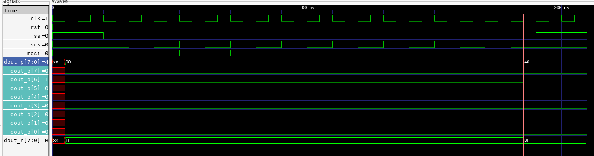

Analog Interface
-------------------

The analog part cosist of eight trasmission gates isolated by a dedicated guard ring,
what should improve isolation between channes. The basic schematic of a trasmission gate 
is shown below

A complete module of the multiplexer is presented on the following figure, where a symbol for a basic 
module of the gate was used in order to abstract the circuit.

