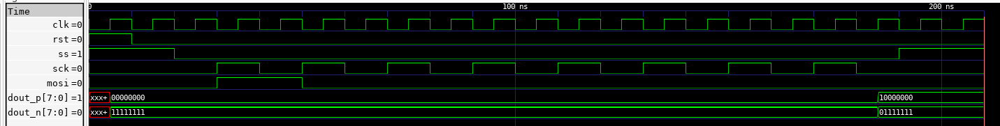

Digital Interface
-------------------

The digital interface is based on a basic version of a SPI (Serial Peripherial Interface) bus.
The verilog module deinition establishes the interface signals. Apart standard signaling 
like ``clk, mosi, miso, ss`` the module is clocked by general ``clock`` signal and have 
parell input/output data access via ``dion/dout`` buses. Once the transmission of 8 bits is completed
a ``done`` signal is asserted by the module. 

.. code-block:: verilog

  module spi(
      input clk,
      input rst,
      input ss,
      input mosi,
      output miso,
      input sck,
      output done,
      input [7:0] din,
      output [7:0] dout
    );
   
Since the design of analog multiplexer require digital control signals the presented design we will
not use input paralell interface. Instead the SPI module was wrapped by a module named ``control``
in order to expose only the necesary signals and enable compementary signal generation (every transmission
gate need a pair of control signals). The ``control`` module definition can be found below:

.. code-block:: verilog

  module control(
      input clk,
      input rst,
      input sck,
      input mosi,
      input ss,
      output miso,
      output [7:0] dout_p,
      output [7:0] dout_n
    );

In order to simulate and verify the behaviour of the module a ``control_tb.v`` test bench was created. 
It sequence the value of the ``0x80`` throught ``mosi`` line and asserts other control signals. The result of the simulation
is shown below:

  

As shown the value of the registers ``dout_p`` and ``dout_n`` are re-seted on the rising edge of the clock while ``rst`` signal is asserted (synchronous reset).
After 8 clock cycles of the ``sck`` signal the register's values are updated on the first rising edge of the ``clk`` signal.

.. note::

  In the directory ``design_data/verilog/spi/`` one can find a Makefile, which runs the test bench and shows the waveforms in GTKWave. Calling ``make full`` will result in on additional step which is compilation of a shared library ``control.so`` and its placement in ``design_data/xschem/multiplexer/simulations``. 
