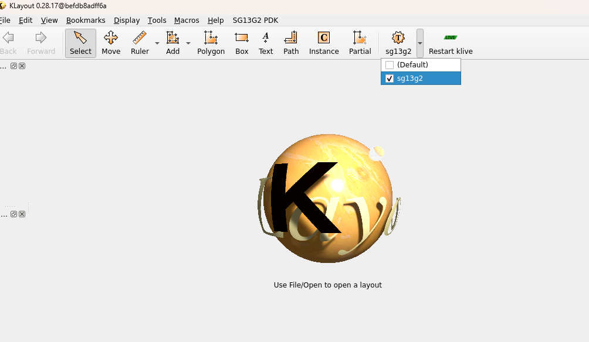
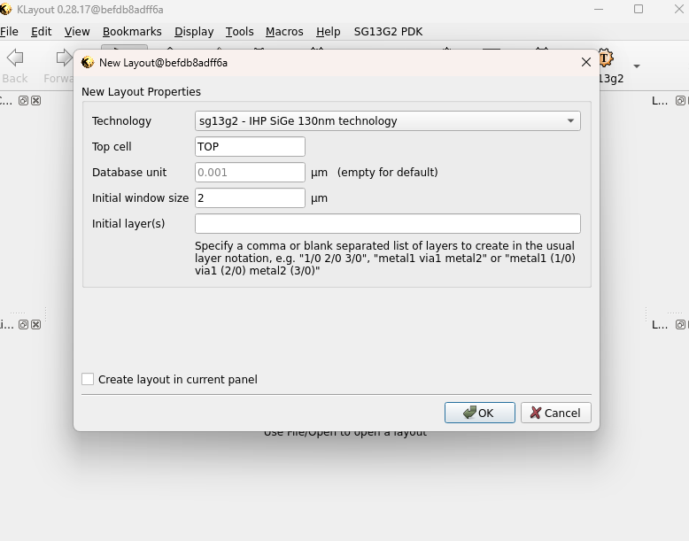
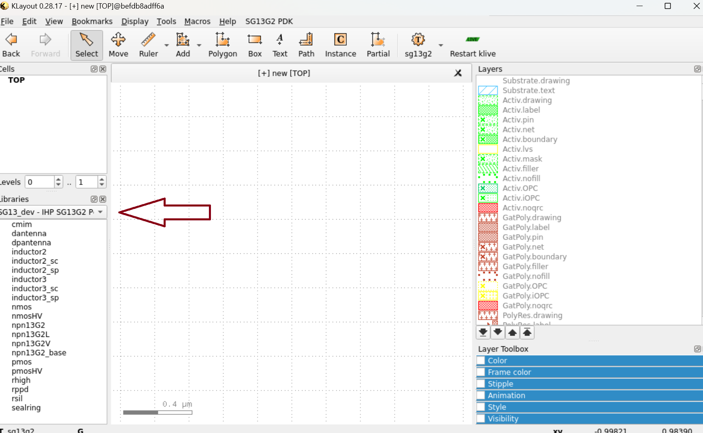
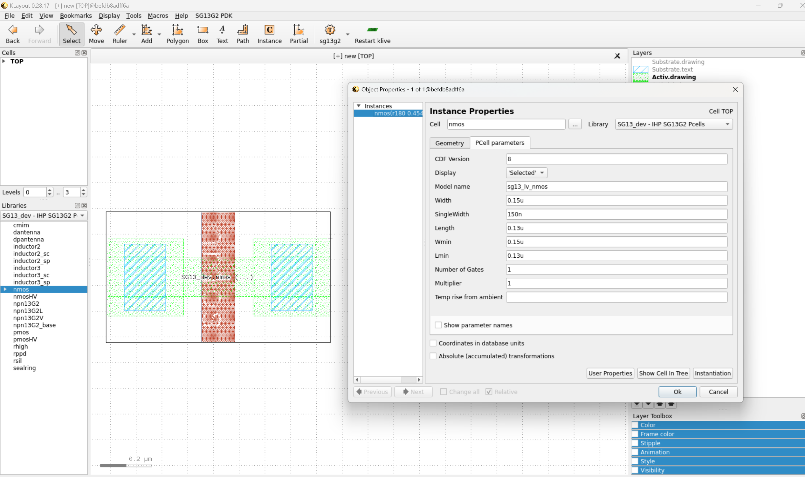

Layout design using Klayout
=============================

In this workshop, we will explore the fundamentals of layout design for mixed-signal microelectronics using KLayout, an open-source layout editor. Utilizing the IHP SG13G2 PDK, we will ensure our designs meet the necessary fabrication requirements, guiding you through the essential steps to create and verify layouts for manufacturing.

Parametric Cells
----------------

PCells, or Parameterized Cells, are reusable layout components that can be customized by adjusting parameters such as width, length, or device type. This allows designers to efficiently create and modify layout elements without redrawing them from scratch.

Instantiating PCells in KLayout:

1. Open KLayout in edit mode using:

.. code-block:: bash
    
    klayout -e

2. Change the technology from 'Default' to 'sg13g2':

3. Now you need to create a new layout. To do this, go to the File tab and select New Layout. Make sure to choose the correct technology by verifying that it is IHP SG13G2, and then click OK to proceed. 

4. The next step is to select the PCell library from the window at the bottom left. A list of all available PCells will appear.

5. To instantiate a PCell, simply select the desired PCell and drag it into the workspace. Once instantiated, you can modify its parameters by double-clicking on the PCell.

