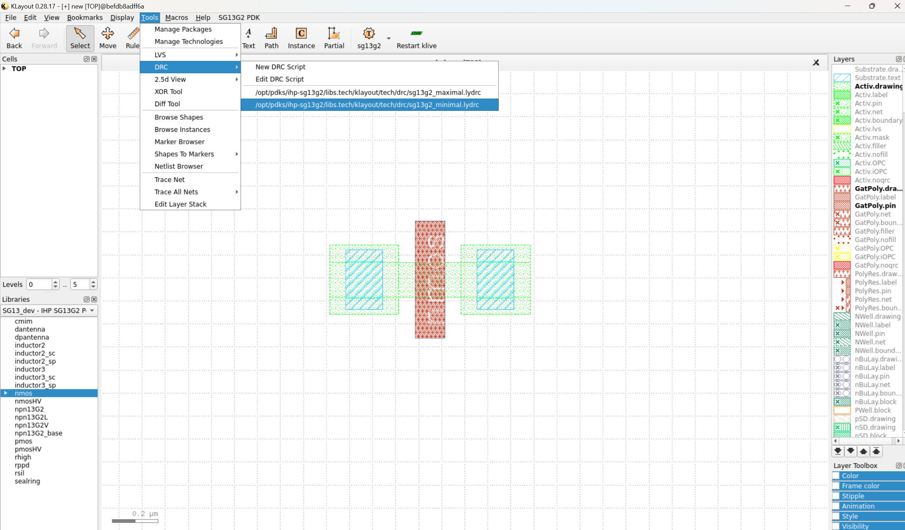
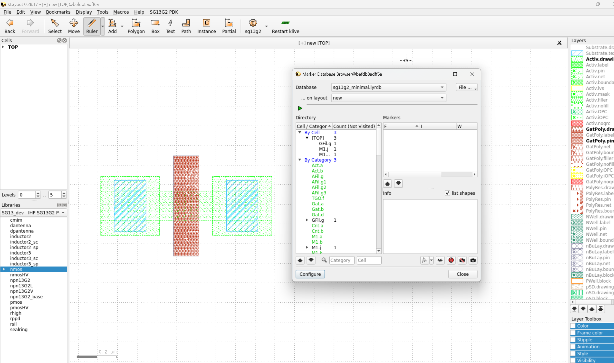
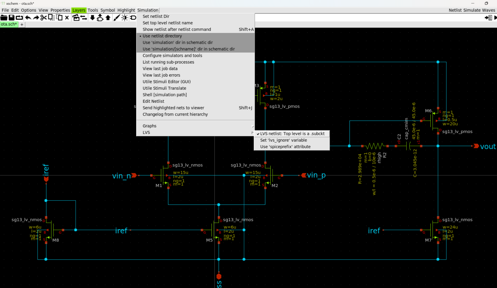
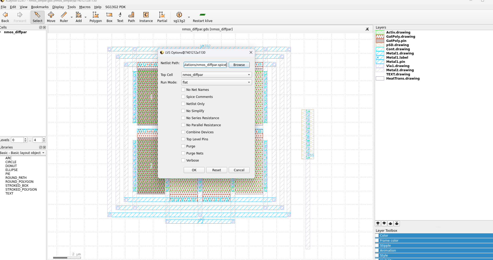
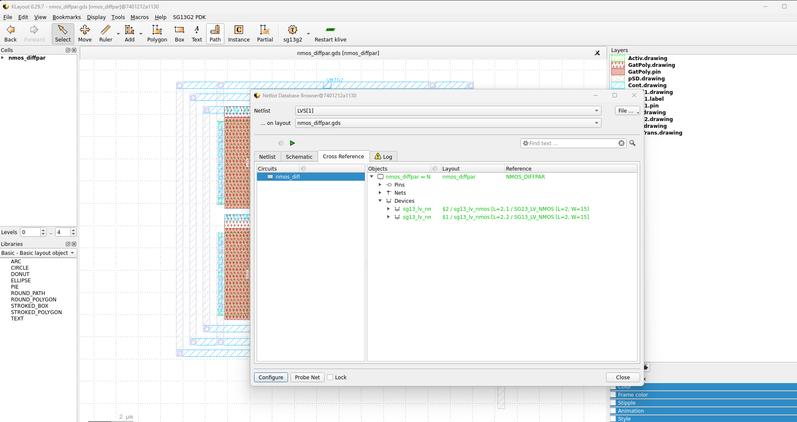

Physical Verification
=======================

Design Rule Checks
------------------

Design Rule Checks (DRC) are essential in ensuring that your layout complies with the manufacturing rules of the foundry. These rules define the minimum spacing, width, and other geometrical constraints that must be followed to ensure a successful fabrication.

1. To run the DRC check, go to the Tools tab, select DRC, and then choose the Minimal or Maximal Verification file.

2. To view the DRC results, go to the Tools tab and select Marker Browser. In the pop-up window, choose the corresponding database.

Layout vs. Schematic
--------------------

LVS (Layout vs. Schematic) is a verification step that ensures your layout matches the schematic at a netlist level. This step is crucial in confirming that the physical layout correctly represents the intended design functionality.

1. First, you need to correctly extract the netlist from Xschem. To do this, open your schematic in Xschem, go to the Simulation menu, select LVS, then choose the LVS Netlist option, and make sure to uncheck the Use SpicePrefix option.

2. Now, navigate to the SG13G2 PDK tab and click on SG13G2 LVS Options. In the pop-up window, enter the path of the netlist file that you want to use for the LVS check.

3. Finally, in the same SG13G2 PDK tab, select Run KLayout LVS. The LVS process will begin, and a window displaying the results will appear once it’s complete.

