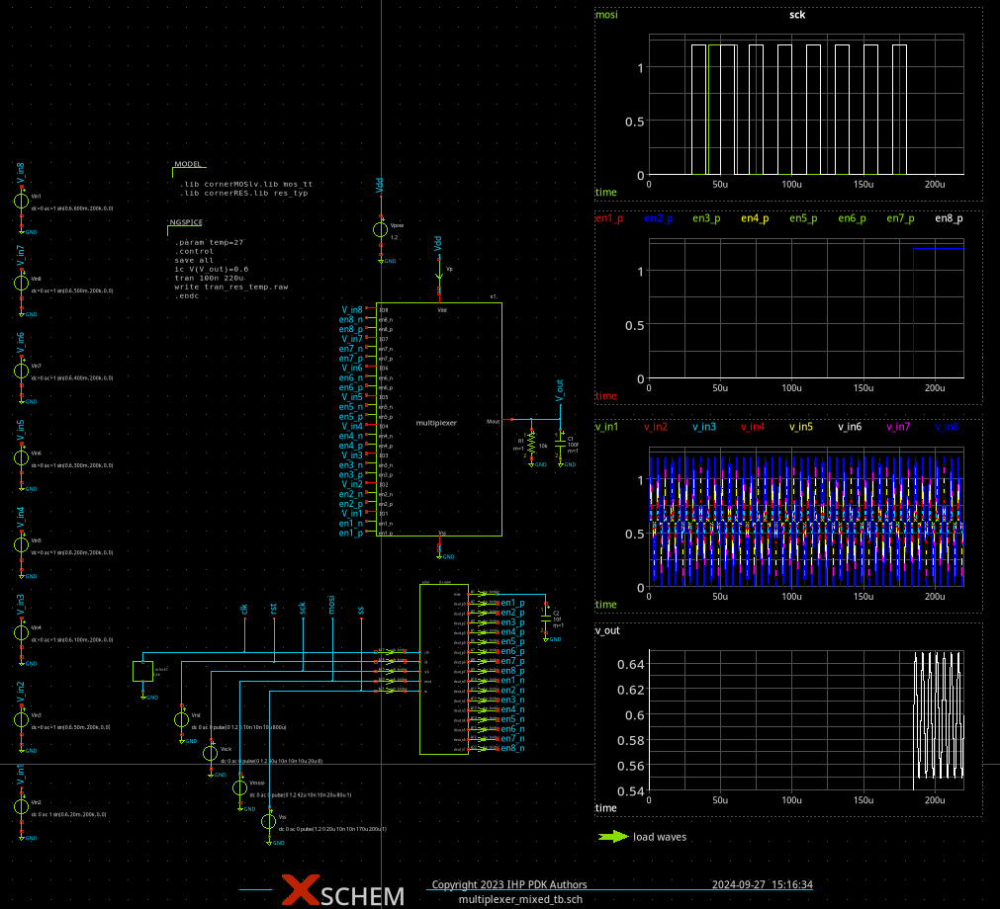
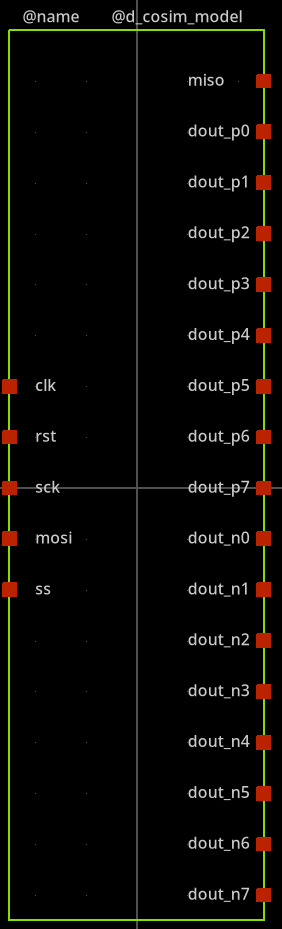
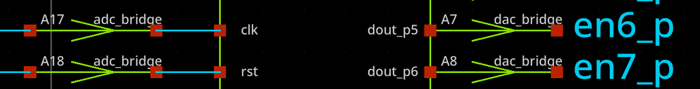

Schematic capture
==================

The XSHEM schematic capture permits to draw a schematic diagram, setup the simulation and visualise the results.
A testbench of the multiplexer circuit with an SPI interface can be found below:

The cruitial part of the schematic is the symbol of the digital module  which should be ``pin to pin`` compatible with the verilog module.
It is important to ensure the correct order of the input/output pins. The buses are not supported so it should de expanded to a binary signals in the 
spice netlist as shown below:

Verilog module defintion:

.. code-block:: verilog

  module control(
    input clk,
    input rst,
    input sck,
    input mosi,
    input ss,
    output miso,
    output [7:0] dout_p
    output [7:0] dout_n
  );

Xschem symbol defintion ``*.sym`` defines not only geometry of the symbols but also the way how the schematic representation of the circuit will be streamed into the spice
netlist. In the case of the ``d_cosim`` block this part can look as follows:

.. code-block:: bash
 
  K {type=delay
  verilog_ignore=true
  vhdl_ignore=true
  format="@name [ @@clk @@rst @@sck @@mosi @@ss ] [ @@miso @@dout_p0 @@dout_p1 @@dout_p2 @@dout_p3 @@dout_p4 @@dout_p5 @@dout_p6 @@dout_p7  @@dout_n0 @@dout_n1 @@dout_n2 @@dout_n3 @@dout_n4 @@dout_n5 @@dout_n6 @@dout_n7 ] null @dut 
  .model @dut @d_cosim_model  simulation=@model"
  template="name=adut
  dut=dut
  d_cosim_model= d_cosim
  model=./control.so
  "
  }

The above code after netlisting will result in the following entry:

.. code-block:: spice

  adut [ net6 net5 net4 net3 net2 ] [ net8 net9 net10 net11 net12 net13 net14 net15 net16 net17 net18 net19 net20 net21 net22 net23 net24 ] null dut
  .model dut d_cosim simulation=./control.so

.. warning:: 

  During the simulation it is critical to ensure that the ``control.so`` shared object is available in the directory where the simulator is called. 

The graphical representation of the symbol of the digital commponent is shown below

Another important step is the interfacing. While all other components in ngspice simulation can be routed directly the routing of the singals 
crossing the analog-digital domains is made differently by using so called bridges. The bridges are component, which define 
the input and output levels of voltages to be represented as logic "1" and logic "0" and also define mapping of digital signals into analog voltages. 
As shown on the following figure the `adc` and `dac` bridges are connected to the digital module. 

The following spice code defines these modules: 

.. code-block:: spice

  A17 [ clk ] [ net6 ] adc1
  .model adc1 adc_bridge in_low=0.2 in_high=1.0
  A6 [ net9 ] [ en6_p ] dac1
  .model dac1 dac_bridge out_low=0.0 out_high=1.2

As shown the bridges use the following template ``InstanceName [ input ] [ output] ModelName`` 
