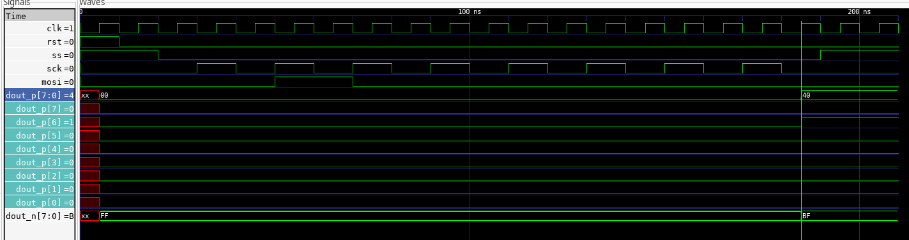
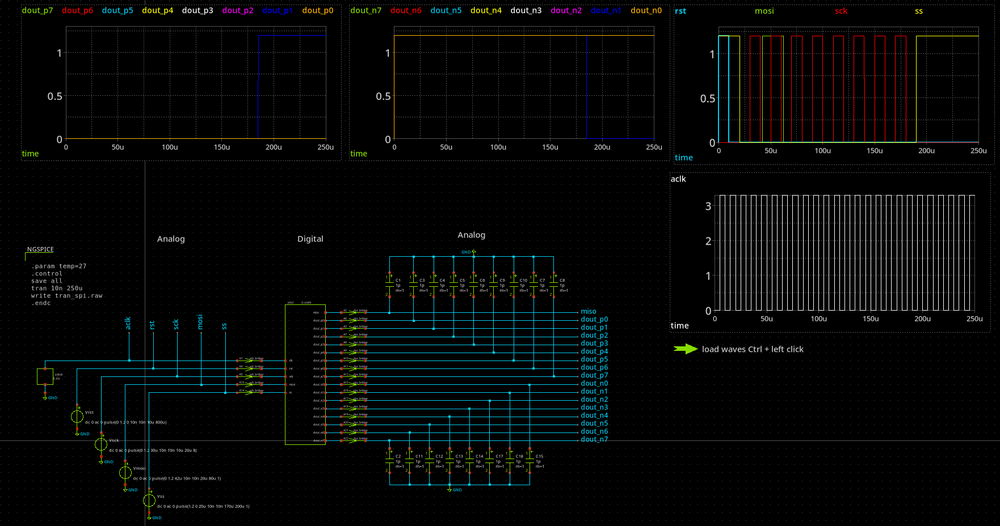
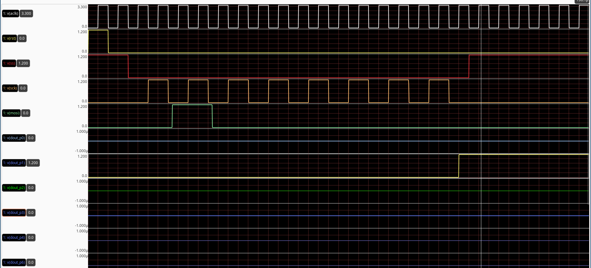

Simulation
===========

Simulations of analog circuits in open source usually incorporate simulators like ngspice or Xyce in order 
as a simulation engine. Comparing booth simulators it can be easily stated that ngspice has better support 
for so called mixed mode simulation mainly thanks to XSPICE module developed at Georgia Tech in 90' 
`XSPICE documentation <https://ngspice.sourceforge.io/devdocs.html>`_.

Each digital block can be abstracted in the ngspice simulation using a subcircuit, which instantiates a 
device using a behavioral model elaborated using ``verilator`` and loaded into simulator during the runtime as a shared 
library ``top.so``.

.. code-block:: spice

  .subckt digital_block ain1 ain2 ain3 aout1 aout2

  acomp [ainp1 ainp2 ainp3] [inp1 inp2 inp3] adc
  .model adc adc_bridge in_low=0.2 in_high=1.0

  adut [inp1 inp2 inp3] [out1 out2] null dut
  .model dut d_cosim simulation="./top.so"

  abridge1 [out1 out2] [aout1 aout2] dac1
  .model dac1 dac_bridge(out_low = 0.0 out_high = 1.2 input_load = 5.0e-12 t_rise = 5e-9 t_fall = 2e-9)

  .ends 

The ADC and DAC bridges have to be used in order to cross between the domains.

The digital module can be elaborated using either Verilator (recommended) or Iverilog.
After a successful validation of a digital module one can execute the following command in order to 
prepare a shared library, which can be used during the ngspice simulation. 

.. code-block:: bash

  ngspice vlnggen top.v 

The XSPICE extension of ngspice provides various elements, which simplify modeling and simulation of the 
mixed signal circuit. The ``d_osc`` can be used to instantiate a clock source as shown in the following example 
where the net ``clk`` is driven by a 100kHz source.

.. code-block::

  aclock 0 clk clock
  .model clock d_osc cntl_array=[-1 1] freq_array=[100k 100k]

Simulation of a SPI module in digital an mixed signal domains
--------------------------------------------------------------

A  simulation of the digital block which contains SPI module  can be performed using ``iverilog`` and ``GtkWave``. 
The testbench will generate respective control signals includeing ``clk``, ``sck``, ``ss`` and ``rst`` and also will
propagate serial data throught ``mosi`` line. 

.. code-block:: bash 
  
  iverilog -o ctrl.out control.v spi.v control_tb.v 
  vvp ctrl.out
  gtkwave control_tb.vcd
  

The generated signals can be observed on the following image:

In order to simulate the same circuit in the mixed signal domain one should use the ``d_cosim`` XSPICE module 
in the ``ngspice`` simulation. The first step is to generate a shared object which will be used by this module 
during the simulation. It can be made by calling the following:

.. code-block:: bash 
  
  ngspice vlnggen control.v 

The next step involves a xschem symbol creation which references respective inputs and outputs. Since the digital module 
drives the transmission gate transistors the load we apply has a capacitive character.  

The following image shows  a complete schematic which instantiates SPI module and generates stimuli signals in 
order to drive the digital module inputs. :which

The transient simulation results are stored in ``tran_spi.raw`` file which can be opened by ``GAW`` waveform viewer as shown below: 

